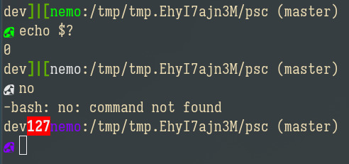

# PSC  
_Custom ps1 prompt for bash_  

---  

__Install:__  
1. Compile the C components:  
    - `gcc errname.c -o errname`  
    - `gcc glyph.c -o glyph`  
2. Add them to somewhere on your path:  
    - `mv ./{errname,glyph} ~/.local/bin/`  
3. Source ps1.sh every time your bash environment initializes, or add it's contents to ~/.bashrc  
    - `. ps1.sh`  
    - `cat ps1.sh >> ~/.bashrc`  
